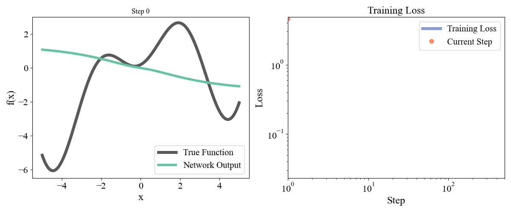
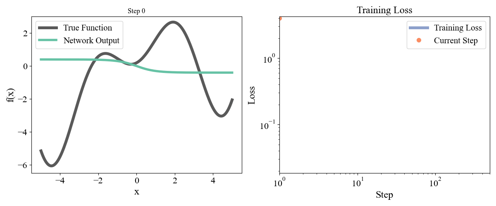
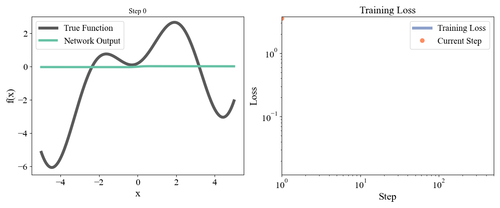
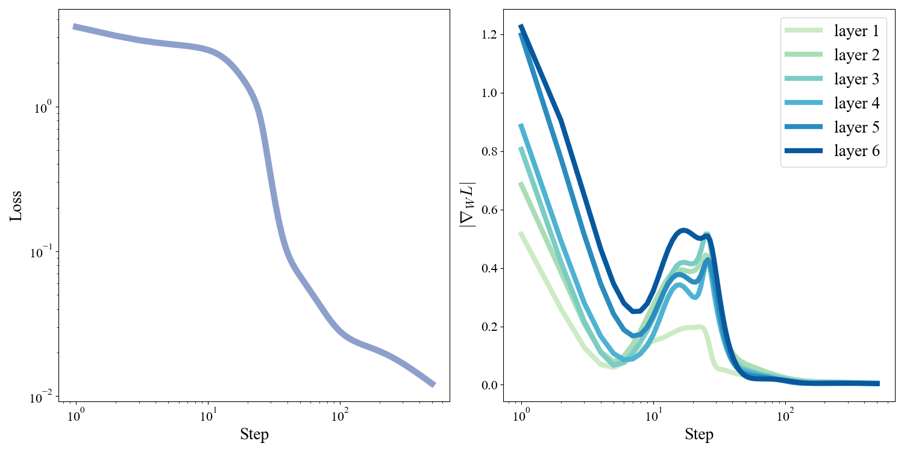

```{python}
import numpy as np
import matplotlib.pyplot as plt
import matplotlib as mpl

mpl.rcParams.update({
    "font.family": "serif",
    "font.serif": ["Computer Modern Roman", "Times New Roman", "DejaVu Serif"],
    "mathtext.fontset": "cm",
    "xtick.labelsize": 16,
    "ytick.labelsize": 16,
})

np.random.seed(42)
```

Throughout his career Richard Feynman would periodically take and fill a fresh notebook titled "Notebook of Things I Don't Know About" [@gleick1992genius]. This was a space to deconstruct his understanding of things and rebuild physics from the ground up; discovering new perpectives, gaps in his knowledge, "oiling the parts", and reducing the branches of physics to their core kernels. Inspired by this (and by recently bombing a technical interview) I decided to do the same for my understanding of ML and chronicle my notes in this blog, starting with backpropagation.

A narrow perspective on ML is that ML is the science of learning _functions_. A classifier is a function that takes in images (for example) and spits out labels. An LLM is a function that takes in a string of text, and returns the next token. We are never given access to the function itself, but instead a dataset $\mathcal{D}$ of inputs $x$ and associated outputs $y$. Our goal then is to discover the function that explains and hopefully generalizes the data. This picture is most clearly motivated in regression problems. After a few false starts is the mid-late 20th century, the field settled on a neuroscience (and physics) inspired _parametric_ approach to learning due to it's scalability and flexibility. As the saying by Von-Neumann goes:

:::{.callout}
"With four parameters I can fit an elephant, and with five I can make him wiggle his trunk."
:::

The idea is to start from a generic class of functions $f_{\theta}(x)$ controlled by parameters $\theta$. One example would be
$$
f_{\theta}(x) = \theta_0 + x\theta_1
$$
corresponding to linear regression. One can then tune the $\theta$ so that the function matches the outputs $y$ as closely as possible. We do this systematically by defining a loss function which is minimized when the function matches the desired output, and finding the parameters $\theta$ which achieve this. A simple and common example is the Mean-Squared Error, or $L2$ loss
$$
L(x, y; \theta) \equiv \frac{1}{2}(f_{\theta}(x) - y)^2
$$
The total loss is obtained by averaging this over the entire dataset of $(x,y)$ pairs. In practice it is impossible to solve for the minimizing $\theta$ directly, except in a few special cases like polynomial regression. A more algorithmic approach is to minimize $L$ via _gradient descent_. Since the gradient $\nabla_\theta L$ points in the direction of steepest increase of $L$ in $\theta$ space, updating the parameters as
$$
\theta_i \to \theta_i - \eta \frac{\partial L}{\partial \theta_i} 
$$
will decrease $L$. We can iterate this until the $\theta$ converge to a fixed value and $\nabla_\theta L \approx 0$ at it's minimum, hopefully the global one! There are _many_ better ways to perform gradient descent that I will cover in a separate post, but all of them require you to be able to compute the gradient of the loss function.

Modern ML takes its parameterized functions from a zoo of models that fall broadly under the umbrella of **Neural Networks**. Taking the derivative of such functions with respect to their parameters is a complex and challenging task. For models with sometimes billions(!) of parameters, and a gradient descent step that needs to be iterated possibly millions of times, we need a way to quickly and efficiently compute the gradient of the loss. Enter: Backpropagation. The idea the underpins nearly all of modern learning theory utilizes the feedforward, recursive nature of neural networks to systematically construct their gradients. We will start by reviewing (without motivation) feedforward neural network architecture, before moving on to derive the backpropagation algorithm in the simplest setting where the network has a width of $1$ at all layers. Once we have ascertained the basic pattern in this simple setting, we will generalize to arbitrary feedforward networks. We will end by seeing how to implement this in practice, and discovering some of the common failure modes of training. 

When I started this, I expected that this would be a quick rederivation and write up (and in a sense it was). But after a series of wrong turns and some debugging I realized that there are _alot_ of techniques and ideas that I take for granted without thinking too deeply about, either because they are wrapped up in PyTorch or because I have accepted them as common wisdom without asking why they came about. This post is the entry point to a very wide and deep subject of how do we actually train networks in practice. My plan is to use these lessons as a jumping off point to explore new ideas in future posts.


# Neural Network Architecture
We will consider functions from $\mathbb{R}^{n_0}\to \mathbb{R}^{n_L}$. The idea behind a neural network is to parameterize our function by a succesive series of linear transformations followed by non-linearities until we arrive at an output $\vec{a}_L\in\mathbb{R}^{n_L}$. Specifically, a neural network with $L$ layers of widths $\left\{n_l\right\}_{l=1}^{L}$ consists of _weight matrices_ $W_l \in \mathbb{R}^{n_l\times n_{l-1}}$, _biases_ $\vec{b}_l \in \mathbb{R}^{n_l}$, a _non-linearity_ or _activation function_ $\phi_l:\mathbb{R}\to\mathbb{R}$, and the defining recursive equations:
$$
\vec{a}_0 = \vec{x}, \;\; \vec{z}_l = W_l \vec{a}_{l-1} + \vec{b}_l, \;\; \vec{a}_l = \phi_l(\vec{z}_l)
$$
where $\vec{x}$ is the input to the network. The $\vec{a}_l$ are referred to as the activations at layer $l$, and the $\vec{z}_l$ as the pre-activations. Layers in between the input and output layers are sometimes referred to as _hidden layers_. By $\phi_l(\vec{z}_l)$ we mean the vector formed by applying $\phi_l(\cdot)$ to each component of $\vec{z}_l$ independently. Typically $\phi_l(\cdot)$ will be the same for all $l$ except $l=L$ where it is common to take $\phi_L(x) = x$, so there is no non-linearity in the final layer. We denote the derivative of the activation by $\phi'(\cdot)$. Some common non-linearities include the tanh activation
$$
\phi(x) = \tanh(x) = \frac{e^x - e^{-x}}{e^x + e^{-x}}, \;\; \phi'(x) = 1 - \tanh^2(x)
$$
and the ReLU, or Rectified Linear Unit:
$$
\phi(x) = \text{ReLU}(x) = \max(0, x), \;\; \phi'(x) = \Theta(x) = \begin{cases} 1 & x > 0 \\ 0 & x \leq 0\end{cases}
$$
Where $\Theta(x)$ is the Heaviside step function. The functions and their derivatives are shown below.

```{python}
#| label: fig-act
#| fig-cap: Activation functions.
#| fig-format: png
#| out-width: "100%"
#| fig-align: center
#| 
fig, ax = plt.subplots(1, 2, figsize=(10,5));
x = np.arange(-3.5, 3.5, 0.05);

ax[0].plot(x, np.tanh(x), lw=5, c='#66c2a5', label='$\phi(x)$');
ax[0].plot(x, 1 - np.tanh(x)**2, lw=5, c='#e78ac3', label='$\phi\'(x)$', zorder=0);
ax[0].legend(fontsize=15)

ax[1].plot(x, x*np.heaviside(x,0), lw=5, c='#66c2a5');
ax[1].plot(x, np.heaviside(x,0), lw=5, c='#e78ac3', zorder=0);


ax[0].set_title('tanh$(x)$', fontsize=17.5);
ax[1].set_title('ReLU$(x)$', fontsize=17.5)
ax[0].set_ylabel('$\phi(x)$', fontsize=17.5);
ax[0].set_xlabel('$x$', fontsize=17.5);
ax[1].set_xlabel('$x$', fontsize=17.5);
```

With all of these pieces we can create a function $f(x) = \vec{a}_L:\mathbb{R}^{n_0}\to \mathbb{R}^{n_L}$ parameterized by the weights $W_l$ and biases $\vec{b}_l$ of the network. Letting an input pass through the network and populate the activations in each layer is called the _forward pass_ of the network. Notice how the feedforward nature of the network means the output can be written as a nested series of functions
$$
a_L = \phi_L(W_L \phi_{L-1}(W_{L-1} \phi(W_{L-2} \phi_{L-2}(\ldots \phi_1(W_{1} \vec{x} + \vec{b}_{1})\ldots) + \vec{b}_{L-2}) + \vec{b}_{L-1}) + \vec{b}_L)
$$
This provides a convenient means for us to organize the gradient of the function: we will see that repeated function applications can be differentiated by repeated applications of the chain rule. This recursive chain rule application acts in some sense like a pass through the network, but the recursion now happens in reverse.

# The Backpropagation Algorithm

## Scalar Case
Let's consider the simplest possible network with $n_l = 1 \, \forall l$ and no biases in order to get a sense for how the feedforward structure of neural architecture determines its gradient. In this case we have
$$
a_0 = x, \;\; z_l = w_l a_{l-1}, \;\; a_l=\phi_l(z_l)
$$
for a given input-output pair $(x,y)$ we then have the loss
$$
L(x, y; \{w\}) = \frac{1}{2}(a_L(x) - y)^2
$$
which we want to minimize as a function of the $w_l$. Thus we are interested in the gradient
$$
\frac{\partial L}{\partial w_l}
$$
Since $L$ only depends on $w_l$ via $z_l$ and downstream quantities, we can use the chain rule to break up the derivative as
$$
\frac{\partial L}{\partial w_l} = \frac{\partial L}{\partial z_l}\frac{\partial z_l}{\partial w_l} \equiv \delta_l a_{l-1} 
$$
where we have defined
$$
\delta_l \equiv \frac{\partial L}{\partial z_l}
$$
We have decomposed the derivative into 2 terms: the incoming activation, and the sensitivity of the loss function to the pre-activation at that layer. To compute the derivative $\delta_l$ imagine perturbing the pre-activation $z_l$. This propagates \textit{forward} through the network and perturbs $z_{l+1}$. Using the chain rule we can write:
$$
 \frac{\partial L}{\partial z_{l}}= \frac{\partial L}{\partial z_{l+1}}\frac{\partial z_{l+1}}{\partial z_l} = \delta_{l+1} w_{l+1}\phi_{l}'(z_l) \implies \delta_l = \delta_{l+1} w_{l+1}\phi_{l}'(z_l)
$$
this gives a recursive equation for the $\delta_l$ that moves _backwards_: knowledge of the derivative at later layers allows you to compute the derivative in earlier layers. This is precisely a consequence of the feedforward nature of the network. Perturbations  at late layers don't affect early layers, but perturbations at early layers affect late layers. All we need to compute this recursion is the boundary condition which can be computed directly
$$
\delta_L = (a_L - y)\phi_L'(z_L)
$$

Imagine the "forward pass" as starting from the input and sequentially moving through the network to populate the activations:
$$
a_0 \xrightarrow[]{z_1} a_1 \xrightarrow[]{z_2} a_2 \xrightarrow[]{z_3} \ldots \xrightarrow[]{z_L} a_L
$$
Once these activations are populated, we start at the output and move backwards to populate the $\delta_i$:
$$
 \delta_1 \xleftarrow[]{w_{2} \phi_{1}'(z_{1})} \delta_2 \ldots \delta_{L-2}\xleftarrow[]{w_{L-1} \phi_{L-2}'(z_{L-2})} \delta_{L-1} \xleftarrow[]{w_L \phi_{L-1}'(z_{L-1})} \delta_L
$$
Note that we need to make the forward pass first to populate the network with activations that are then used in the backpropagation. Once all of the $\delta_l$ are computed we can compute the parameter gradients simply via
$$
\frac{\partial L}{\partial w_l} = \delta_l a_{l-1} 
$$

## General Case
Now that we have a feel for how things should be organized, and what the answer might look like, let's consider the general case with arbitrary $n_l$ and biases:
$$
\vec{a}_0 = \vec{x}, \;\; \vec{z}_l = W_l \vec{a}_{l-1} + \vec{b}_l, \;\; \vec{a}_l = \phi_l(\vec{z}_l)
$$
The loss now generalizes to an $L2$ norm
$$
L = \frac{1}{2}||\vec{a}_L - \vec{y}||^2 = \frac{1}{2} \sum_{k=1}^{n_L}(a_L^k - y_k)^2
$$
We proceed exactly as before, using the chain rule to express things in terms of the gradient w.r.t. $\vec{z}_l$, but we now have to specify the indices of the component of the weight matrix we are taking the derivative with respect to:
$$
\frac{\partial L}{\partial W_{l}^{ij}} =  \frac{\partial L}{\partial z_{l}^{i}}\frac{\partial z_{l}^i}{\partial W_{l}^{ij}} = \delta_{l}^i a_{l-1}^j
$$
We have generalized the definition of $\delta$ from above to carry the index $i$ of the preactivation we are taking the derivative with respect to. In vector terms, we can express it as a gradient $\vec{\delta}_l = \nabla_{\vec{z}_l} L$. The weight $W_l^{ij}$ connects the $j$th activation in layer $l-1$ to the $i$th preactivation in layer $l$, so only $\delta_l^i$ and $a_{l-1}^j$ contribute to the derivative. In vector form
$$
\nabla_{W_l} L = \vec{\delta}_l \vec{a}_{l-1}^T
$$ {#eq-gen-grad}
where we take the outer product on the RHS. Similarly for the biases we have
$$
\frac{\partial L}{\partial b_{l}^{i}} =  \frac{\partial L}{\partial z_{l}^{i}}\frac{\partial z_{l}^i}{\partial b_{l}^{i}} = \delta_{l}^i, \;\; \nabla_{\vec{b}_l} L = \vec{\delta}_l
$$
As before we seek a recursive equation for $\vec{\delta}_l$ so that we can compute it via backpropagation. Applying the multivariable chain rule to the next layer gives:
$$
\frac{\partial L}{\partial z_{l}^{i}} = \sum_{k=1}^{n_{l+1}} \frac{\partial L}{\partial z_{l+1}^{k}} \frac{\partial z_{l+1}^k}{\partial z_{l}^{i}}
$$
Using the fact that
$$
z_{l+1}^k = \sum_{h=1}^{n_l} W_{l+1}^{kh}\phi_l(z_l^h) + b_l^k \implies \frac{\partial z_{l+1}^k}{\partial z_{l}^{i}} = W_{l+1}^{ki} \phi_l'(z_l^i)
$$
we have
$$
\delta_l^i = \sum_{k=1}^{n_{l+1}} \delta_{l+1}^k W_{l+1}^{ki} \phi_l'(z_l^i)
$$
or in vector form
$$
\vec{\delta}_l = (W_{l+1}^T\vec{\delta}_{l+1})\odot \phi_l'(\vec{z}_l)
$$ {#eq-gen-bp}
Where $\odot$ denotes the Hadamard product between the two vectors, meaning we multiply the individual vector components together entry by entry. With the boundary condition
$$
\vec{\delta}_L = (\vec{a}_L - \vec{y})\odot \phi_L'(\vec{z}_L)
$$
we can perform backpropagation exactly as before to form the $\vec{\delta}_l$, and from there the corresponding gradients.

The final generalization is to consider a loss which is averaged over a dataset of size $B$:
$$
L = \frac{1}{2B}\sum_{b=1}^B ||\vec{a}_L(\vec{x}_b) - \vec{y}_b||^2
$$
Since the derivative is a linear operation and this is a sum over losses on a single pair, the gradients will backpropagate independently and simply add up over all the different points in the dataset. We simply need to form the $(B\times n_L)$ matrix
$$
\vec{\delta}_L^b = \frac{1}{B}(\vec{a}_L^b - \vec{y})\odot \phi_L'(\vec{z}_L^b)
$$
and backpropagate this whole matrix. Here $\vec{z}_L^b$ and $\vec{a}_L^b$ denote the (pre)activations populated by the input $\vec{x}_b$.

## Backpropagation for Classifiers
For classification problems, it is often convenient for the output layer to represent the probability of classifying the input as each of the possible classes. In this case the output pre-activations are referred to as the _logits_ and the non-linearity $\phi$ that produces a normalized probability distribution over classes is called the SoftMax:
$$
a_L^i = \frac{e^{z_L^i}}{\sum_j e^{z_L^j}}
$$
For classificiation problems we assume the output $\vec{y}$ is a _one-hot_ encoding of the label, meaning that if there are $K$ possible classes and the true label is for example $k=3$, then we would represent $\vec{y} \in \mathbb{R}^K$ as a $K$ dimensional vector with $1$ in the dimension indexed by the label $3$ and every other entry set to $0$: $\vec{y} = (0, 0, 0, 1, 0, \ldots 0, 0)$ (we index starting from $0$). We then take as the loss the negative log-likelihood of the label under the distribution predicted by the network, sometimes referred to as the cross entropy:
$$
L = - \vec{y}\cdot\ln(\vec{a}_L) = -\ln (a_L^y)
$$
where $a_L^y$ denotes the component of $\vec{a}_L$ indexed by the one-hot label of $\vec{y}$. In order to do backpropagation in theis case we need to compute
$$
\delta_L^i = \frac{\partial L}{\partial z_L^i} = -\frac{1}{a_L^y}\frac{\partial a_L^y}{\partial z_L^i}
$$
First, consider the cae where $i\neq y$:
$$
\frac{\partial a_L^y}{\partial z_L^i} = -e^{z_L^i}\frac{e^{z_L^i}}{(\sum_k e^{z_L^k})^2} = - a_L^y a_L^i
$$
for the $i=y$ case we have
$$
\frac{\partial a_L^y}{\partial z_L^y} = \frac{e^{z_L^y}\sum_k e^{z_L^k} - e^{z_L^y}e^{z_L^y}}{(\sum_k e^{z_L^k})^2} = a_L^y - (a_L^y)^2 = a_L^y(1 - a_L^y)
$$
Thus we have
$$
\delta_L^i = \begin{cases} a_L^i & i \neq y \\ a_L^i - 1 & i=y \end{cases}
$$
or in vector form
$$
\vec{\delta}_L = \vec{a}_L - \vec{y}
$$
Which is strikingly similar to the case for the $L2$ loss.

# Implementation
The nature of backpropagation suggests a simple practical implementation where layers act as modular units responsible for their forward and backward passes. Layers and non-linearities can then be chained together to build arbitrary networks. We do this in 2 parts, separating out the responsibilities of the linear transformation and the non-linearity.
```{python}
#| code-fold: false
class LinearLayer:
    def __init__(self, d_in, d_out):
        self.W = np.random.randn(d_out, d_in) * np.sqrt(1 / d_in)
        self.b = np.zeros(shape=(d_out))

        self.x = None
        self.dW = None
        self.db = None

    def forward(self, x):
        """
        x: (B, d_in)
        """
        self.x = x
        return x @ self.W.T + self.b

    def backward(self, delta_z):
        """
        delta_z: (B, d_out)
        """
        self.dW = delta_z.T @ self.x
        self.db = np.sum(delta_z, axis=0)
        return delta_z @ self.W

    def step(self, lr):
        self.W -= lr * self.dW
        self.b -= lr * self.db
```
We initialize the weights with a mean $0$ normal distribution with variance $1/d_{in}$. This is sometimes referred to as _LeCun Initialization_[^note2]. On the forward pass the layer computes the preactivations and caches the input so that it can compute the gradient in the backward pass according to @eq-gen-grad. The backward pass takes $\vec{\delta}_{l}$ as computed at $l+1$ and uses this to construct the gradients `dW` and `db`. The backward pass then propagates $W_{l}^T \vec{\delta}_l$ backward to layer $l-1$. Note that this is _not_ $\vec{\delta}_{l-1}$ as defined in @eq-gen-bp. We have left off the derivative of the activation function, so this backward pass technically only returns $\nabla_{\vec{a}_{l-1}} L$. The logic is that the derivative of $\phi(\cdot)$ should be handled by the activation function class. Once gradients are computed there is a simple function to take a gradient descent step with learning rate `lr`. We can implement a simple tanh activation function as
```{python}
#| code-fold: false
class Tanh:
    def __init__(self):
        self.z = None
        self.a = None

    def forward(self, z):
        """
        z: (B, d_l)
        """
        self.z = z
        self.a = np.tanh(z)
        return self.a

    def backward(self, dLda):
        """
        dLda: (B, d_l)
        """
        return dLda*(1.0 - np.square(self.a))
```
The forward pass takes pre-activations and similarly caches $z$ and $a$ for the backward pass. The backward pass takes the $\nabla_{\vec{a}_{l-1}} L$ output of the `LinearLayer` backward method and implements @eq-gen-bp to form $\vec{\delta}_{l-1}$. These pieces can be chained together into a single `FeedForward` class to orchestrate the recursive forward and backward passes, as well as the gradient descent step for all of the network parameters. 
```{python}
#| code-fold: false
class FeedForward:
    def __init__(self, widths = [1, 2, 1], activation = Tanh):
        self.widths = widths
        self.depth = len(widths) - 1
        self.layers = [LinearLayer(widths[d], widths[d+1]) for d in range(self.depth)]
        self.activations = [activation() for _ in range(self.depth-1)]

    def forward(self, x):
        for i in range(self.depth-1):
            x = self.activations[i].forward(self.layers[i].forward(x))
        x = self.layers[-1].forward(x)
        return x
    
    def backward(self, loss_grad):
        dlda = self.layers[-1].backward(loss_grad)
        for i in np.arange(self.depth-1)[::-1]:
            dldz = self.activations[i].backward(dlda)
            dlda = self.layers[i].backward(dldz)

    def step(self, lr):
        for layer in self.layers:
            layer.step(lr)
```
The architecture is specified completely by the choice of activation function and list of layer depths. Note that we do not apply a non-linearity on the final layer, so $\phi_L'(x) = 1$. The backward pass takes the base case $\vec{\delta}_L$ as the starting point, which can wrapped nicely into a loss class:
```{python}
#| code-fold: false
class MSELoss:
    def __init__(self):
        self.pred = None
        self.y = None

    def forward(self, pred, y):
        """
        pred: (B, d_L)
        y: (B, d_L)
        """
        self.pred = pred
        self.y = y
        return 0.5*np.mean(np.sum(np.square(pred - y), axis=1))
    
    def backward(self):
        B = self.pred.shape[0]
        return (self.pred - self.y) / B
```
Given a dataset of `x, y` pairs, a model can be initialized and trained as
```python
model = FeedForward()
loss_fn = MSELoss()
lr = 0.01
steps = 1000
for n in range(steps):
    pred = model.forward(x)
    loss = loss_fn.forward(pred, y)
    grad = loss_fn.backward()
    model.backward(grad)
    model.step(lr)
```

Easy!

[^note2]: There is _alot_ to say about how to initialize weights of a network and the effect it has, and will hopefully be the subject of a future post. The rough intuition is that at initialization the preactivations will be the sum of a bunch of random numbers, you don't want this sum to get too big so the more possible inputs, the smaller their variance should be in accordance with the CLT.

# A Simple Example
Let's see how this works in practice by training some nets to do regression on data from a random function from $\mathbb{R}\to\mathbb{R}$. I chose
$$
y = a\cos(bx) + x\sin(cx) - d\,\text{tanh}(e x)
$$
with `a, b, c, d, e = [ 0.19677237,  0.75164323,  1.1048082 ,  1.61985818, -0.37817787]` sampled randomly from a normal and frozen. Our data consists of $x$ points from $-5$ to $5$ with an even spacing of $0.05$ and the associated $y$ points. Let's start with a simple network with one hidden layer with a width of `10`. We optimized for `50000` steps with a learning rate of `0.001`. Training dynamics are visualized below:

::: {.content-visible when-format="html"}
{#fig-l1-train}
:::

On the left we see how the network approximation to the function contorts itself towards the true function over time, and on the right we see the loss curve smoothly decrease as expected. Let's now try a deeper network with 2 hidden layers and widths of `10` each, so `model = FeedForward(widths = [1, 10, 10, 1])`.

::: {.content-visible when-format="html"}
{#fig-l2-train}
:::

The network output moves more quickly towards the true function and is able to approximate the function much more closely. Do we get more gains from training deeper? Lets try a network with 5 hidden layers with widths of `10`:

::: {.content-visible when-format="html"}
{#fig-l2-small}
:::

Despite having more parameters and more depth, things don't look quite as good here. The network forms a few odd kinks and settles down to the solution more slowly. It seems that the supposed gains from larger, deeper networks are not so straightforward to obtain.

## Exploding and Vanishing Gradients

To understand what happens to our training dynamics in deeper networks, lets take a look at the norms of the gradients of the 5 hidden layer network during training.

{#fig-grad-norms}

If we split the gradients by layer, we see a striking pattern: gradients at earlier layers are systematically smaller than later layers. This is exactly due to the fact that gradients propagate backwards. At each step of the backpropagation $\delta$ is multiplied by $\phi'$, but for the tanh function $\phi'(x) = 1 - \tanh^2(x) < 1$ since $-1 < \tanh(x) < 1$ for finite $x$. Thus as we propagate backwards we repeatedly multiply by numbers $<1$ and the gradients shrink. This can be exacerbated by the repreated matrix multiplications as well if the eigenvalues of $W^T$ are $< 1$. This phenomenon is referred to as the _Vanishing Gradients_ problem and is a major bottleneck to training extremely deep networks. One reason for the popularity of $\text{ReLU}$ activations is that they help mitigate this problem because their gradients are not limited to $< 1$.

There is also a corresponding _Exploding Gradients_ problem that can arise if the eigenvalues of $W^T$ are $> 1$ for exactly the same reason. 
This can be caused by poor initialization for example, and is why it is so crucial to initialize $W$ as random normal scaled down by $\sqrt{d_{in}}$. These are all lessons I had to learn the hard way when implementing these networks for this write up. There are a number of architectural solutions to these problems (batch and layer normalization, residual streams) that I hope to cover in future posts. For now I simply want to stress that training is extremely sensitive to the seemingly arbitrary choices we make for our activation functions and parameter initialization.

# Epilogue

Backpropagation is simple and elegant, but one of the key takeaways from a naive application of gradient descent to deep learning is that training networks in practice is frustrated by a variety of competing factors. We'll see more examples of the possible failure modes that can arise as we tackle increasingly challenging real world problems. Over the next couple posts I hope to compile a broad collection of practical techniques and theoretical results to help train deep networks on challenging real world problems (unlike the ones considered here).

_Code for the experiments run in this post can also be found on [Github](https://github.com/anooppraturu/Backpropagation)._