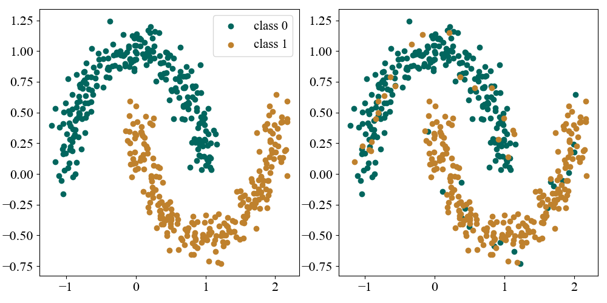
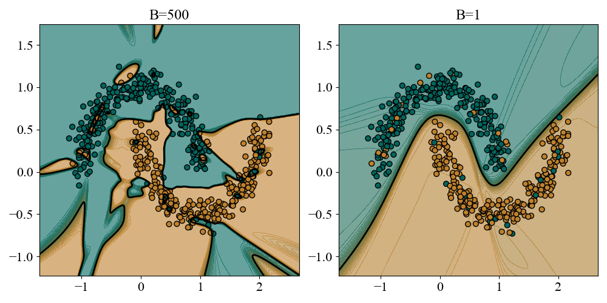
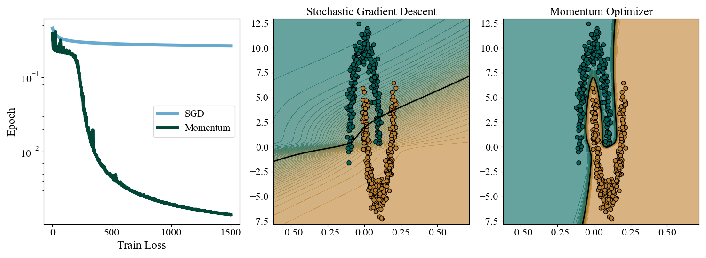
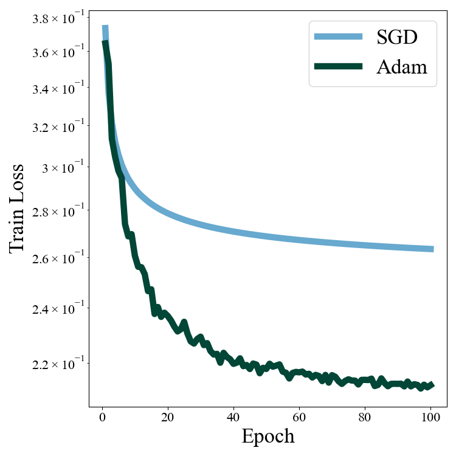
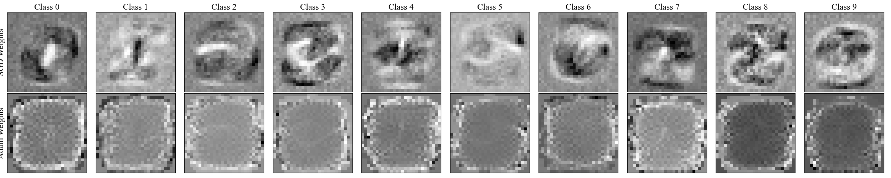

```{python}
import numpy as np
import matplotlib.pyplot as plt
import matplotlib as mpl

mpl.rcParams.update({
    "font.family": "serif",
    "font.serif": ["Computer Modern Roman", "Times New Roman", "DejaVu Serif"],
    "mathtext.fontset": "cm",
    "xtick.labelsize": 16,
    "ytick.labelsize": 16,
})

np.random.seed(42)
```

The [first post](https://anooppraturu.github.io/posts/backprop/) in my "Notebook of things I Don't Know About" was about gradients. Specifically, how to take them in deep feedforward neural networks. This post will be about what to do with them. As discussed before (and in approximately a million other places in the literature and on the internet) the reason we care about taking gradients is so that we can minimize loss functions with respect to their parameters by stepping _down_ the gradient:
$$
\theta_{t+1} = \theta_t - \eta \nabla_\theta L(\theta_t)
$$
The art of minimizing (or maximizing) something is referred to as optimization, and is a very old field that predates ML. There are types of problems that we call convex optimization problems that are easy to solve. Training neural networks is not one of these problems. The goal of this post is to take a tour of the methods of optimization used in ML beyond standard gradient descent. A key observation that we will see is that different optimizers don't provide different means to the same solution, but rather different optimizers give us _different solutions_ to the optimization problem. Optimizers at their core are a way for us to probe and shape the geometry of the loss landscape. As we go from stochastic gradient descent all the way through to the state of the art Adam optimizer, we will continuously ask: what is unique about how this optimizer probes the loss function, and how does this give rise to the solution it finds?


# Stochastic Gradient Descent
The development of stochastic gradient descent actually predates deep learning, but it was quickly applied in ML because the problems that motivated also appear frequently in ML. Though initially developed as a sort of "compromise" to make large scale training feasible, it was realized much later that SGD has a number of appealing practical and theoretical properties that in fact lead to _better_ training dynamics than straightforward gradient descent.

We start with the standard setup: given a datset of $N$ samples we would like to minimize the average loss with respect to the parameters $\theta$
$$
L(\theta) = \frac{1}{N}\sum_{i=1}^N \ell_i(\theta)
$$
where $\ell_i$ denotes the per sample loss. In the large dataset limit (imagine terabytes or petabytes of data) it is infeasible to run $N$ forward passes of the network for each gradient descent step. The core idea of stochastic gradient descent is to split the dataset into $N/B$, $B$ sized "batches" of data. For each gradient descent step we pick a single batch denoted $\mathcal{B}$ and compute the batch loss
$$
L_{\mathcal{B}}(\theta) = \frac{1}{B}\sum_{i\in \mathcal{B}} \ell_i(\theta)
$$
and compute the gradient of this approximation to the full loss to perform gradient descent

::: {.callout}
$$
\begin{aligned}
g_{\mathcal{B}}(\theta)\equiv \frac{1}{B}\sum_{i\in\mathcal{B}} \nabla_\theta \ell_i(\theta) \\
\theta_{t+1} = \theta_t - \eta g_{\mathcal{B}}(\theta_t)
\end{aligned}
$$ {#eq-SGD}
:::

where $\eta$ is the learning rate, and the discrete time index $t$ denotes how many gradient descent steps we have taken. The cost of a forward pass is now reduced from $O(N)$ to $O(B)$, and for each full pass over the dataset (referred to as an "epoch") we are able to take $N/B$ gradient descent steps. The batches are partitioned randomly and typically the data is resplit into new batches on each epoch. The compromise is that our gradient is not the "true" gradient:
$$
g_{\mathcal{B}}(\theta) = \nabla_\theta L + \xi_{\mathcal{B}}
$$
where $\xi_{\mathcal{B}} = g_{\mathcal{B}}(\theta) - \nabla_\theta L$ is the difference between the batch and true gradient and acts as a noisy fluctuation on the true gradient. $g_{\mathcal{B}}$ is an "unbiased estimator" of the true gradient in the sense that $\mathbb{E}[\xi_{\mathcal{B}}] = 0$, where the average is taken with respect to batches. This is the basic idea: using $g_{\mathcal{B}}$ for our gradient descent is much more efficient and should on average produce similar results to $\nabla_\theta L$.

SGD requires one final modification. Since the gradients are noisy the training dynamics will never converge to a fixed minimum but instead approach an equilibrium distribution where the model parameters "jitter" around the loss landscape. One way to see this is to write down the equations for _Simulated Annealing_:
$$
d\theta_t = -\nabla_\theta L dt + \sqrt{2 T} dW_t
$$
$T$ is referred to as the temperature and $W_t$ denotes a _Wiener Process_, which means that the increments $dW_t$ are uncorrelated gaussian noise. The idea behind simulated annealing is that gradient based optimization will often get stuck in false minima or flat regions in which the gradient alone weakly pushes the parameters. By adding noise whose strength is controlled by $T$, these fluctuations can help the optimizer explore the space more robustly. In this language we can think of annealing as a random walk, or more generally a _Stochastic Process_, that is directed down the direction of the gradient. A stochastic process is a generalization of a probability distribution whose samples are random paths through space. Under SGD we can write the training dynamics as
$$
d\theta_t = -\nabla_\theta L dt + \sqrt{2 D(\theta_t)} dW_t
$$ {#eq-langevin}
Where $D(\theta_t)$ now acts as an anisotropic temperature that arises from the variance of our stochastic estimator of the gradient.
We can think of the trajectory of parameters during training as a random path sampled from an annealing-like stochastic process. A crucial ingredient for annealing is the use of a _Cooling Schedule_. Over time the temperature $T$ is reduced so that the optimizer can actually settle down to the true minimum after exploring the many peaks and valleys of the space, instead of jittering around endlessly. In SGD we take a similar by reducing the learning rate over time via a _Learning Rate Scheduler_. There are many possible schedulers that each have their own theoretical and practical strengths, here we will simply consider a power law schedule
$$
\eta_t = \frac{\eta_0}{(1 + t/\tau)^\alpha}
$$
where $\eta_0$ is the initial step size, $\tau$ controls the time around which the learning rate starts appreciably decreasing, and $\alpha \geq$ determines how rapidly it decreases. Common values are $\alpha=1, 1/2$, while $\alpha=0$ corresponds to a fixed learning rate.


## Implementation and Example Problem
Let's consider how we might implement SGD and see how it performs in practice on a dificult problem. Making use of the `FeedForward` class we built in the [previous post](https://anooppraturu.github.io/posts/backprop/) we can abstract the responsibilities of the optimizer into it's own class that is responsible for scheduling and implementing gradient steps

```python
class SGDOptimizer:
    def __init__(self, FeedForward: model, float: lr0, float: a, int: tau):
        self.model = model
        # learning rate schedule parameters
        self.lr0 = lr0
        self.a = a
        self.tau = tau
        self.t = 0

    def step(self):
        # step scheduler
        self.t += 1
        lr = self.lr0 / np.power(1 + self.t / self.tau, self.a)
        # step parameters
        for layer in self.model.layers:
            layer.W -= lr*layer.dW
            layer.b -= lr*layer.db
```

This abstraction will be especially useful when we look at more sophisticated optimizers that track more temporal information than just the learning rate schedule. We can implement batching with this optimizer in a simple training loop.

```python
model = FeedForward()
loss_fn = MSELoss()
optim = SGDOptimizer(model, 0.01, 1.0, 5000)
epochs = 1000
batch_size=4
N = x.shape[0]

for epoch in range(epochs):
    # Random shuffling of data
    shuffle_order = np.random.permutation(N)
    for i in range(0, N, batch_size):
        # Select batch
        batch = shuffle_order[i: i + batch_size]

        # Forward pass on batch
        pred = model.forward(x[batch])
        loss = loss_fn.forward(pred, y[batch])

        # Compute batch gradient
        grad = loss_fn.backward()
        model.backward(grad)

        # step learning rate and parameters
        optim.step(lr)
```
We'll test SGD on the classic "Two moons" dataset consisting of data from 2 different classes in the shape of interlocking crescent moons. We will add slight twist where we randomly flip the class label of each point with probability $p=0.1$, as shown below on the right.

{#fig-data}

This modification makes the problem harder because the 2 classes are no longer cleanly separated, and learning the pattern that separates the 2 moons is confounded by the flipped labels. We'll consider the problem in a moderately overparameterized setting where we have $N=500$ datapoints and train a deep network with 2 hidden layers of width $64$ using a cross entropy loss. We trained a suite of models over a range of batch sizes up to $B=500$, which corresponds to standard "full-batch" gradient descent. We varied the number of epochs for each batch size so that each model was trained for $1.5\times 10^6$ steps, and all models used a step size scheduler with $\eta_0 = 0.15$, $\alpha=1$, $\tau = 5\times 10^4$. A summary of training dynamics and performance is shown below.

{#fig-train-dynamics}

At first glance it seems from looking at the leftmost panel of figure @fig-train-dynamics that SGD is worse: The train loss decreases almost monotonically with increasing batch size. Stochasticity in the gradients pushes the model towards seemingly worse loss minima. The middle panel shows the flip side of this tradeoff; the train time is reduced from a few minutes for full batch gradient descent to a few seconds for small batches. The most revealing metric however is the model's test set accuracy. How well do the models generalize to unseen data? We generated $N_{test} = 500$ new points and looked at the accuracy of the models on both clean and noisy labels. We repeated this $100$ times and plot the mean and standard deviation of the test set accuracies in the right hand panel. Surprisingly, models with smaller batches and more stochasticity generalize much better to the test set in both the clean and noisy setting[^note0]. Why is this? We can get a hint by looking at the decision boundaries learned by different models. 

{#fig-boundaries}

Full batch gradient descent is able to interpolate the data exactly, flipped labels and all, by carving out little islands and jagged boundaries to encompass the train set perfectly. While this allowed full gradient descent to push to a much lower train loss, the cost is that the decision boundary is riddled with noise and obscures much of the actual pattern separating the 2 classes. Stochastic gradient descent (for reasons we have not yet specified) does not attempt to interpolate the flipped labels and settles on a much higher train loss. A consequence is that the decision boundary is much cleaner and more interpretably captures the structure of the classes. This naturally leads to much better generalization, even when the test set is corrupted by noise as well.

[^note0]: It is not always strictly true that the smallest batch size $B=1$ leads to the best generalization as in this example.

## Wide Versus Narrow Minima {#sec-minima}

It is clear that SGD leads to a different solution of the loss minimization problem. It is therefore useful to distinguish between the different possible solutions that an optimizer can find, and which ones we might prefer. One broad distinction is to think about wide and shallow minima of the loss function vs deep and narrow minima. Narrow minima have steep walls that rise quickly, and are therefore extremely sensitive to the exact values of the parameters. Even though they may allow for very deep minima, which naively leads to lower train loss, they generalize poorly because unseen data from the test set acts equivalently like a small perturbation to the parameters. To see this, write
$$
x_{test} = x_{train} + \delta x
$$
Then
$$
W_l x_{test} + b_l = W_l x_{train} + b_l', \;\; b_l' \equiv b_l + W_l\delta x
$$
A small difference on test set data can be absorbed into a shift of the parameters, which would incur a large loss penalty on a narrow minimum. It is easy to see how the jagged interpolating decision boundary induced by noisy labels can lead to narrow minima. For $2$ classes the cross entropy loss of a single point can be written as
$$
-\ln a_L = \ln(1 + e^{-\Delta z_L})
$$
where $\Delta z_L \equiv z_{correct}^L - z_{incorrect}^L$ is the margin by which the preactivation of the correct label exceeds the incorrect label. In the interpolating regime $\Delta z > 0$ for all points. Points far from the decision boundary then contribute nothing almost nothing, and we can write
$$
L \approx \frac{1}{N}\sum_{i\sim\text{boundary}} e^{-\Delta z_L^i}
$$
The loss is most sensitive to where the decision boundary delicately threads between oppositely labeled points sitting right on top of each other. You can find many such examples in the left panel of figure @fig-boundaries. Tiny perturbations of the boundary can cause strong swings in the margins $\Delta z$ and severely degrade test set performance. By the same arguments above, the loss in wide minima will be relatively insensitive to parameter/data fluctuations and we expect our results will generalize to the test set in a more stable manner.

The key idea is that SGD incurs these penalties naturally through the fluctuations in the gradient and biases the model away from such narrow minima. To see this slightly more formally, we can leverage the fact that for stochastic langevin dynamics in @eq-langevin the equilibrium distribution in parameters space approaches $P(\theta) \propto e^{-L(\theta)}$. Rather than finding the minimum of the loss, corresponding to the mode of the distribution, we expect the result of SGD to look like a _sample_ from $P$. In high dimensions, samples can look very different from the mode due to volumetric effects. The probability contributed from a given minimum of the loss is $P\approx P(\theta_{min})\text{Vol}(\theta_{min})$. Narrow minima are strongly suppressed by this volume factor, and SGD prefers wide minima with large volumes. This is extremely closely related to the "Evidence" term in bayesian statistics that naturally embodies Occam's Razor. Sampling naturally embodies an integral over parameter space which is biased towards high volume regions of probability, rather than strict maxima. These are all rough, intuitive arguments that can be made much more formal. The main point is that the stochasticity of SGD is not merely a compromise that leads to the same solution as full gradient descent but actually biases training towards more preferable models. This is sometimes referred to _Implicit Regularization_.


# Momentum

In certain simplified settings[^note1] the loss can be written as a quadratic in the parameters, and some exact results for gradient based optimization can be derived. Something that comes out of this is that the convergence rate depends strongly on the "Condition Number" defined by
$$
\kappa = \frac{\lambda_n}{\lambda_1}
$$
where $\lambda_n, \lambda_1$ are the largest and smallest eigenvalues respectively of the Hessian of the loss function at the point we are optimizing from (details can be found in the wonderful post [@goh2017why]). $\lambda_i$ represents the steepness of the loss landscape in direction $i$, and $\kappa$ encodes the difference between the steepest and shallowest directions of the landscape. The ideal case is $\kappa = 1$, where the landscape looks roughly equally steep in all directions. The case where $\kappa \gg 1$ is referred to as "ill conditioned" and is the worst case scenario corresponding to a deep ravine with sharp walls in one direction and a gentle slope in the other. This case is diffucult because the learning rate must have $\eta \lesssim \frac{1}{\lambda_n}$ to ensure that the optimization is stable in the steep direction. This means that the optimization will be painfully slow in the shallow direction where the optimizer may need to to travel a large distance to see appreciable gains in loss.

Momentum based optimizers tackle this problem by importing the idea of "inertia" from physics. Inertia is an objects resistance to changing its trajectory during motion, and allows a particle to retain a memory of previous forces it has encountered. To do this, we look at the temporal evolution of a physical particle moving in the presence of an energy landscape:
$$
\frac{d p}{dt} = - \nabla_x E(x), \;\; \frac{d x}{dt} = \frac{p}{m}
$$
where $p$ is the momentum of the particle. Loss functions are typically derived from the negative log likelihood of the data, which in the parlance of physics we recognize as playing the role of "Energy". In gradient descent the "force" that arises from energy gradients directly updates the parameters. By contrast, in physics forces udpate the momentum, and the particle updates its position via the momentum. Inspired by this, we can introduce a "momentum" in parameter space and devise a corresponding update rule for parameter learning

::: {.callout}
$$
\begin{aligned}
g_t = \nabla_\theta L_{\mathcal{B}}(\theta_t) \\
p_{t} = \beta p_{t-1} - \eta_t g_t  \\
\theta_{t+1} = \theta_t + p_t
\end{aligned}
$$ {#eq-momentum}
:::

where $\beta < 1$ is a _damping_ parameter that allows the momentum to decay to $0$ in the absence of forces. It is easy to show [@mehta2019high] that this update rule is exactly equivalent to the discrete time dynamics of a particle of mass $m$ moving under the influence of an energy landscape with viscous drag.

The momentum update rule from @eq-momentum bears a passing resemblance to the equations for exponential smoothing. This offers the interpretation of the momentum as time weighted average of the recent gradients encountered along the trajectory. The smaller the $\beta$, the quicker the optimizer "forgets" previous momenta. In steep narrow directions, gradients will fluctuate and cancel out on average, whereas in shallow persistent directions gradient can accumulate and "pick up speed". In this sense momentum acts like a low pass filter that filters out high frequency oscillations of the gradient that arise from ill conditioned geometries.

[^note1]: And even practical settings, like kernel regression.

## Stretched Moons
We can implement a `MomentumOptimizer` class in a similar fashion. The optimizer now must carry buffers for the momentum, which we initialize to $0$.

```python
class MomentumOptimizer:
    def __init__(self, FeedForward: model, float: beta, float: lr0, float: a, int: tau):
        self.model = model
        self.beta = beta
        # learning rate schedule parameters
        self.lr0 = lr0
        self.a = a
        self.tau = tau
        self.t = 0
        # buffers for momentum
        self.w_ps = [np.zeros_like(layer.W) for layer in model.layers]
        self.b_ps = [np.zeros_like(layer.b) for layer in model.layers]

    def step(self):
        self.t += 1
        lr = self.lr0 / np.power(1 + self.t / self.tau, self.a)
        for i, layer in enumerate(self.model.layers):
            #update momenta
            self.w_ps[i] = self.beta*self.w_ps[i] + layer.dW
            self.b_ps[i] = self.beta*self.b_ps[i] + layer.db
            #update weights
            layer.W -= lr*self.w_ps[i]
            layer.b -= lr*self.b_ps[i]
```

In order to showcase the optimizer we consruct an ill conditioned problem by stretching the $2$ moons dataset into a very narrow distribution. We generate $500$ train points (with no label noise) and stretch the $x$ coordinates by a factor of $0.1$ and the $y$ coordinates by a factor of $10$. We then train a deep net with $2$ hidden layers of width $64$ with SGD and momentum separately. We train both with $B=8$ for $1500$ epochs with a step size scheduler with $\eta_0 = 0.001$, $a=1$, and $\tau=5000$, and for the momentum optimizer we choose $\beta=0.99$.

{#fig-stretched}

The results are resounding. SGD struggles with the narrow geometry separating the $2$ classes and instead settles on a boundary that roughly cuts the plane in half along the stretched direction. We can see from the loss curve that the momentum optimizers briefly gets caught in this solution, but is able to accumulate enough gradients to roll out of this and into the much lower correct solution. We only dwell briefly on momentum here, but the key idea is that "inertia" acts as a running average of the previous gradient history, and incorporating this information allows us to tame some of the difficulties associated with ill conditioned landscapes.


# Utilizing the Second Moment

It can be shown that momentum gives a quadratic improvement in the optimization rate ($\propto \sqrt{\kappa}$ as opposed to $\propto \kappa$ for standard SGD). While this is a remarkable improvement, there is a theoretically simpler solution to solving ill conditioning. Intuitively, if the loss is ill conditioned we would like to be able to take small steps in the steep directions and large steps in the shallow directions. To do this, suppose we are at a point $x_0$ seeking to optimize a function $f(x)$, and consider Taylor expanding $f$ about the current location
$$
f(x) = f(x_0) + \nabla_x f|_{x_0} \, (x - x_0) + \frac{1}{2}(x - x_0)^T H (x - x_0) + \ldots
$$
The Hessian $H$ (matrix of second derivatives) determines the local geometry of the loss nearby $x_0$, and it's eigenvalues determine the (local) condition number. This geometry is not absolute, but depends on the particular coordinates, or _parameterization_, that we choose. In particular if we let $z = H^{1/2} x$, then in these coordinates the Hessian is well conditioned by definition! Optimization in these transformed coordinates would amount to implementing the direction dependent step size we alluded to above. Unfortunately the Hessian changes depending on where we are in space, so if we wanted to implement this in practice we would need to recompute $H$ at each step and re-transform our coordinates. Both the Hessian calculation and the coordinate transformation are infeasible to implement at every step (or even once!) with the large number of parameters in modern neural architectures.

We can implement the kernel of this idea in a more practical fashion by computing the _second moment_ of the gradient. We can use similar machinery from momentum to keep track of the directions in which the gradients tend to be large, and dynamically rescale these directions without computing the full Hessian. This more directly addresses the ill conditioning problem while retaining the notion of inertia accumulating historical information about gradients, though the physics analogy is less tight here.

## Root Mean Square Propagation

Root Mean Square Propagation (RMSProp) is the simplest way to incorporate the second moment into our optimizer. The idea is to use _exponential smoothing_ to compute the weighted time average of the square of the gradient, and then use this average to rescale the batch gradient at a given timestep. The time averaging is again controlled by a parameter we dub $\beta$ and the update rule is given by

::: {.callout}
$$
\begin{aligned}
g_t = \nabla_\theta L_{\mathcal{B}}(\theta_t) \\
s_t = \beta s_{t-1} + (1-\beta)g_t^2 \\
\theta_{t+1} = \theta_t - \eta_t \frac{g_t}{\sqrt{s_t} + \epsilon}
\end{aligned}
$$ {#eq-rms-prop}
:::

where $\epsilon=10^{-8}$ is a small constant to prevent numerical instabilities when $s=0$, especially near initialization. $s_t$ measures the coordinate directions along which gradients are consistently large, and scales the gradient down. This acts as a cheap diagonal proxy for the Hessian coordinate transform. Notice that while exponential smoothing used to track the second moment is reminiscent of momentum, we do not in fact accumulate a history of the gradient as we did in momentum. There is room to improve!

## Adaptive Moment Estimation

The Adam optimizer (as its known) is the state of the art in modern deep learning because it combines all of the above mentioned techniques into one general use method. It is not _exactly_ RMSProp with momentum. Instead, Adam tracks the mean of the gradient in the same way it does the second moment, and also explicitly corrects for the bias that arises from initializing our estimates of the first and second moment to $0$. This leads to the following update equations

::: {.callout}
$$
\begin{aligned}
g_t = \nabla_\theta L_{\mathcal{B}}(\theta_t) \\
m_t = \beta_1 m_{t-1} + (1-\beta_1)g_t \\
v_t = \beta_2 v_{t-1} + (1-\beta_2)g_t^2 \\
\hat{m}_t = \frac{m_t}{1-\beta_1^t}, \;\;\;\; \hat{v}_t = \frac{v_t}{1-\beta_2^t} \\
\theta_{t+1} = \theta_t - \eta_t \frac{\hat{m}_t}{\sqrt{\hat{v}_t} + \epsilon}
\end{aligned}
$$ {#eq-rms-prop}
:::

$\hat{m}$ and $\hat{v}$ are bias corrected first and second moments of the gradient. The update rule carries both a memory of the recent past of the gradients and a dynamic rescaling of gradients to improve ill conditioning. Note that we need $2$ damping parameters corresponding to the averaging timescales for both moments. It is common to take $\beta_1 < \beta_2$, allowing a longer memory for the size of gradients than for the direction. The optimizer class must now carry buffers for both the first and second moment. In practice, we simply absorb the bias correction terms into the learning rate.

```python
class ADAMOptimizer:
    def __init__(self, FeedForward: model, float: b1, float: b2, float: lr0, float: a, int: tau):
        self.model = model
        self.b1 = b1
        self.b2 = b2
        self.eps = 1e-8
        # learning rate schedule parameters
        self.lr0 = lr0
        self.a = a
        self.tau = tau
        self.t = 0

        #first moment 
        self.w_mt = [np.zeros_like(layer.W) for layer in model.layers]
        self.b_mt = [np.zeros_like(layer.b) for layer in model.layers]
        #second moment
        self.w_vt = [np.zeros_like(layer.W) for layer in model.layers]
        self.b_vt = [np.zeros_like(layer.b) for layer in model.layers]


    def step(self):
        self.t += 1
        debias = np.sqrt(1 - np.power(self.b2, self.t))/(1 - np.power(self.b1, self.t))
        lr = debias*self.lr0 / np.power(1 + self.t/self.tau, self.a)
        for i, layer in enumerate(self.model.layers):
            #update first moment average
            self.w_mt[i] = self.b1*self.w_mt[i] + (1-self.b1)*layer.dW
            self.b_mt[i] = self.b1*self.b_mt[i] + (1-self.b1)*layer.db
            #update second moment average
            self.w_vt[i] = self.b2*self.w_vt[i] + (1-self.b2)*np.square(layer.dW)
            self.b_vt[i] = self.b2*self.b_vt[i] + (1-self.b2)*np.square(layer.db)
            #update weights
            layer.W -= lr*self.w_mt[i] / (np.sqrt(self.w_vt[i]) + self.eps)
            layer.b -= lr*self.b_mt[i] / (np.sqrt(self.b_vt[i]) + self.eps)
```

At this point, I don't feel the need to contrive a specific test problem to show off the capabilities of Adam. It's just better, and pretty much standard in the field. Instead, I want to look at a simple, practical problem, to highlight a counterintuitive aspect of Adam that surprised me when I first came across it. Let's consider solving the MNIST digit classification problem with a simple linear classifer. No hidden layer: just input to output with a cross entropy loss. We'll train a model with SGD and Adam with identical scheduling parameters: $\eta_0 = 0.01$, $\alpha=1$, $\tau=5\times10^4$, and we'll take $\beta_1=0.9$, $\beta_2=0.999$ for the damping parameters. Let's look at the loss curves:

{#fig-adam width=70%}

The Adam optimizer trains to a lower minimum in shorter time. We saw this before in @fig-train-dynamics and know not to accept this blindly. In fact the models have nearly identical test set performance ($0.9226$ for SGD and $0.9224$ for Adam). Why did these optimizers settle on $2$ different models, and what differentiates these models? One of the virtues of a linear model is that it is manifestly interpretable, each of columns of the weight matrix is like a "class representative" in data space that tells us what the model thinks class members should be aligned with. Lets look at the weights directly:

{#fig-weights}

The results are quite surprising (to me)! SGD learns vaguely "template" like weight vectors that contain recognizable features of the images they represent. The Adam solution, despite having lower train loss and equivalent test accuracy, converges on weights that look like uninterpretable grey blobs. The Adam solution seems to make less sense.

Let's build a rough intuition for this phenomena. Suppose the classes are linearly separable (they nearly are). Even after SGD is able to separate the classes, the weight vector will continue to update in order to maximize the margins. Even if all of the classifications are correct, the loss can still be pushed further down by increasing the confidence. In this regime the gradient is dominated by the most difficult points that lie near the boundary, the so called support vectors (we saw a similar phenomenon in @sec-minima). When run for a long time SGD converges on the "maximum margin hyperplane" for the weights that a support vector machine would find, and gives rise to the template like weights that we see. Adam updates, by contrast, effectively happen in a transformed space where the coordinates are rescaled by the time dependent average of the second moment. The maximum margin hyperplane in this space is distributed more broadly across the weight vector and encodes complex correlations between pixels in the class. This is all very hand wavy, and should not be taken too seriously. The important point to take away is that we should not neccesarily jump to accept the optimizer that gives the lowest train loss.


# Closing Thoughts

It is tempting to think that an ML problem is specified completely by the architecture, loss function, and training dataset. The "correct" solution is the unique absolute minimum of the loss function and the only point of interest in parameter space. I think a more fitting perspective is that the _entire_ loss landscape tells you something interesting about the problem at hand. This is supported by the interpretation of a loss function as a negative log-likelihood or posterior. Samples from a distribution over parameter space tell us much more than the mode of said distribution. Optimization is the theory of how we interact with this entire landscape: what regions do we deem important? What geometries are difficult to handle? SGD gives us implicit regularization by adding noise, and brings training closer to Bayesian sampling. Momentum smooths trajectories by effectively applying a low pass filter on gradient dynamics. RMSProp shapes geometry by rescaling the coordinates of parameter space. And finally Adam combines all of these ideas into one neat package. This does not mean Adam is necessarily the best optimizer, but it does have a lot of tricks up it's sleeve. The important point is to not take your optimizer (or anything) for granted, and always have in mind the inductive bias you carry from the particular method you have chosen to explore parameter space.