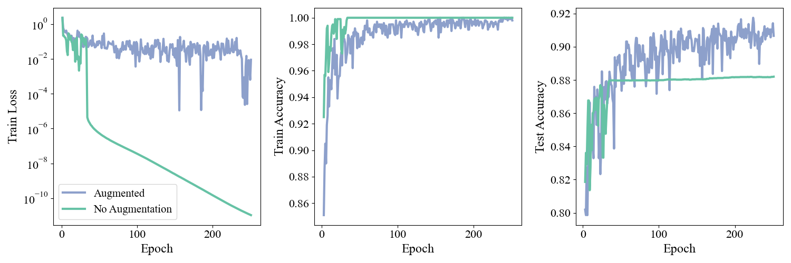
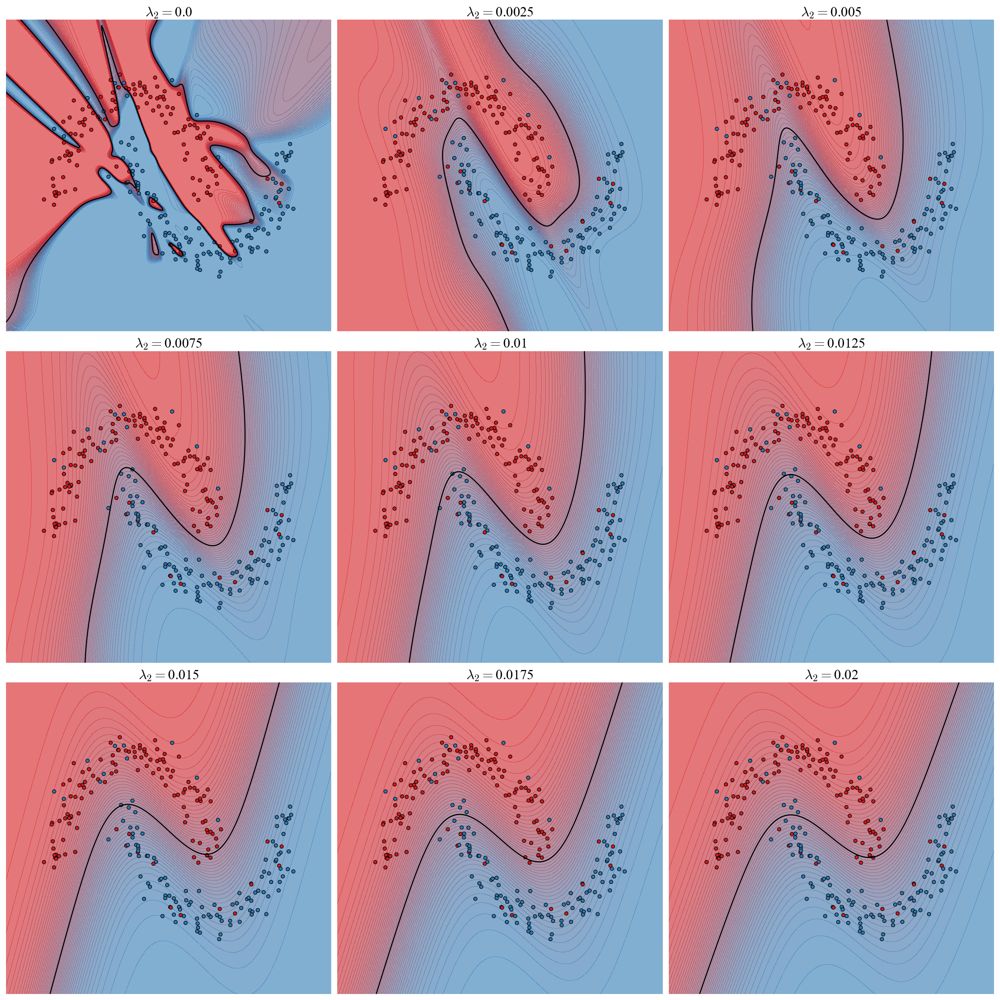
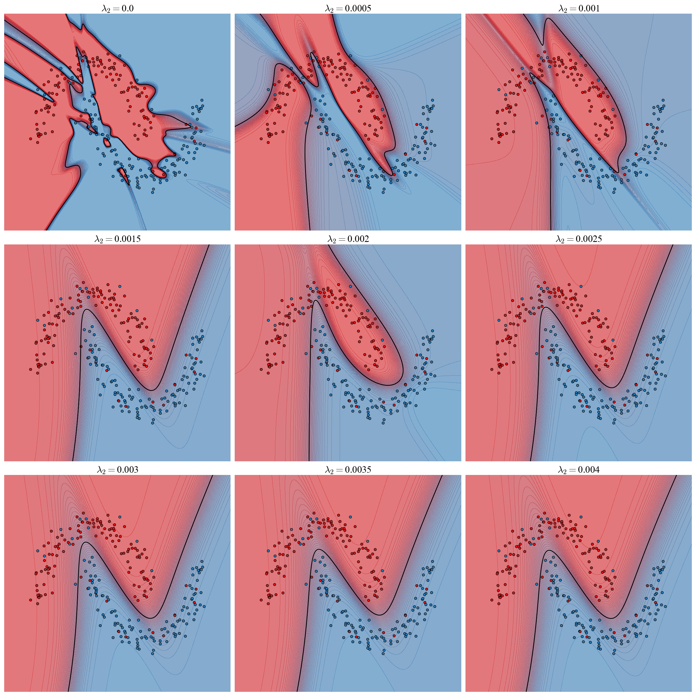
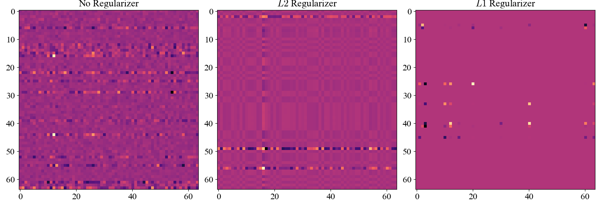
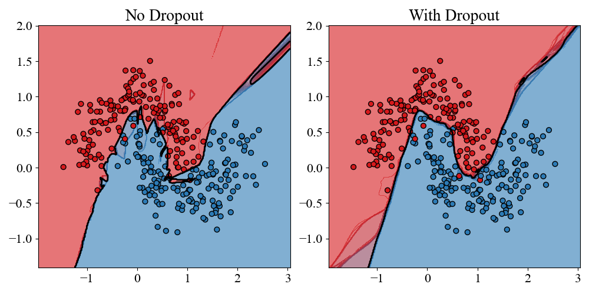
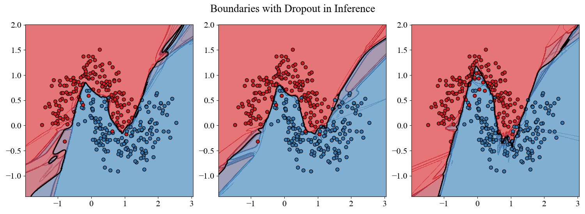
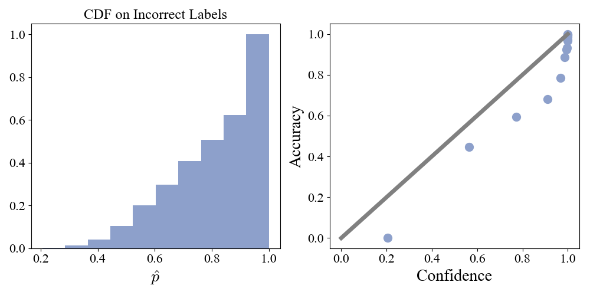
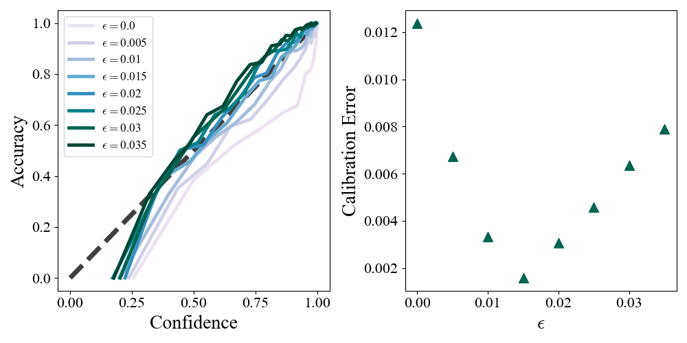
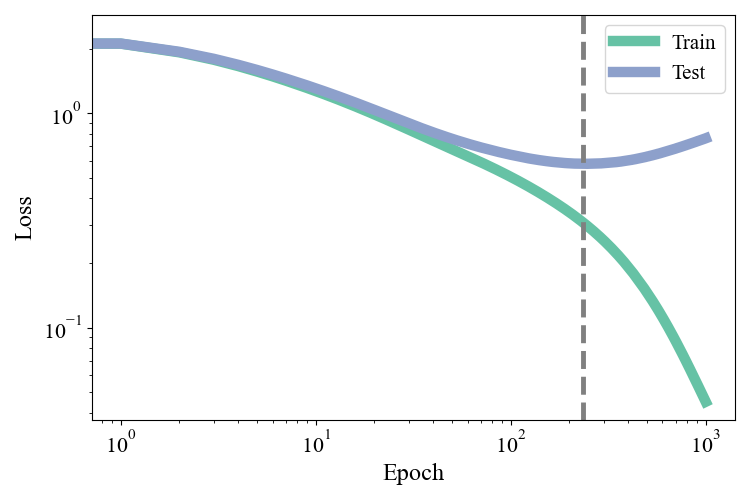
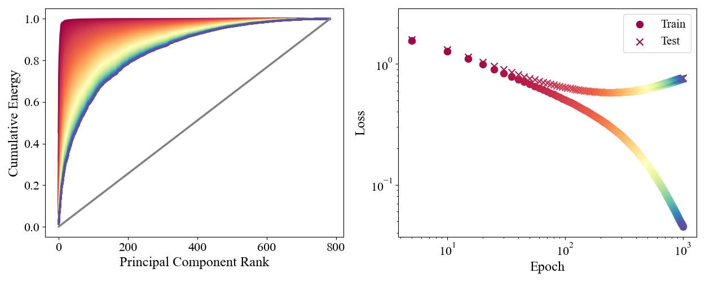

```{python}
import numpy as np
import matplotlib.pyplot as plt
import matplotlib as mpl

mpl.rcParams.update({
    "font.family": "serif",
    "font.serif": ["Computer Modern Roman", "Times New Roman", "DejaVu Serif"],
    "mathtext.fontset": "cm",
    "xtick.labelsize": 16,
    "ytick.labelsize": 16,
})

np.random.seed(42)
```

As we saw in the previous post it is tempting, but incorrect, to think that an ML problem is entirely specified by the data, model architecture, and loss function. Especially in the modern day where we regularly find ourselves in the overparameterized regime (more parameters than data), there are often _many_ solutions which perfectly interpolate the data. It is not enough to specify learning as an optimization problem, but we must somehow specify which among the many possible solutions is best. "Best" is subjective, but usually means "lowest loss on held out data", which we take as a measure of the model's generalization ability. The art of nudging your model towards a preferred solution is called _Regularization_ and is the subject of this installment in the "Notebook of Things I Don't Know About". We saw an example of this in the previous post from stochastic gradient descent: smaller batch sizes led to models with higher test set accuracy.

Perfectly interpolating the training set is sometimes synonymous with "overfitting", which is a term that is always used in the pejorative sense. If modern ML has taught us anything it is that we need to rethink the way we think about overfitting. This is not a can of worms I intend to address here[^note1], but I mention this to say that I don't think interpolating the train set is necessarily bad, and I certainly don't think we should strictly avoid overparameterization. Bayesian non-parametrics, for example, is an area where you have as many parameters as data, but one never frets about "overfitting". We should not view regularization as a method to fight "overfitting" or interpolation, it is a way to encode our inductive bias about what the solution should like. Dogmas like the "bias variance trade-off" are ill suited for the modern era of ML and one can easily construct situations where this fails. This is of course not to say that one _cannot_ overfit in the sense that you can build a model that trains nicely and generalizes poorly. The point is that if you are thoughtful about your modeling choices you can have as many parameters as you (really your GPU) like, and generalize all the better for it. Regularization is a set of tools and intutions for how to be thoughtful in this manner.

An ML problem can be coarsely partitioned into a number of key elements:

- Model inputs
- Weights, that propagate inputs through the network
- Activations, the store the model's "internal representation" of the input at a given layer
- Model outputs
- Training dynamics, that shape the weights to match the desired input-output relationships specified by the training data

Each of these elements admits its own approach to regularization in the form of

- Data Augmentation
- Weight Decay
- Dropout
- Label Smoothing
- Early Stopping

This is obviously not the entirety of regularization methods that exist. I frame things in this way to emphasize the fact that every independent component of an ML problem admits some form of regularization. If you are dealing with a new ML problem that has a component that doesn't fall into these categories, you can probably find a quantitative way to bake your inductive bias into that piece. These are the pieces I will cover, but really regularization is a state of mind, dude.

_Model architecture details for all experiments are listed in_ @sec-experiments.


[^note1]: [Ben Recht has a nice series of posts on overfitting](https://www.argmin.net/p/thou-shalt-not-overfit) that I don't necessarily $100\%$ agree with, but I still found thought provoking and very interesting.

# Data Augmentation

The data that we input to an ML model typically posses many invariances. For example, an image of a "$5$" is still a "$5$" if the image is shifted a few pixels to the right, or slightly rotated. If we augment the input like this we can still put it into to a classifier and demand that the output predict "$5$". In this manner we can generate many possible inputs to train on from a single data point. In a sense we are using our prior knowledge of the task to simulate variations on the training data that mimic the test set, and hopefully helps the model generalize outside of the train set. Let's implement this in a simple setting. We'll take the MNIST dataset but only consider $N=1000$ data points in the train set, and train an overparameterized feedforward classifier. For each batch in the training loop we sample (with replacement) $2$ shift values from `[-2, -1, 1, 2]` with $50\%$ probability and shift every image in the batch in the $x$ and $y$ direction by those many pixels. With $50\%$ probability we do no augmentation. We train this, and a model with $0$ augmentation, and the training dynamics for both models are shown below. Note that the train set accuracies and losses for both models are evaluated on non-augmented data so the comparison is meaningful.

{#fig-aug}

We see that the model without augmentation quickly reaches the interpolating solution at which point the loss curve decreases smoothly without noise and the test accuracy saturates. Once interpolating, the only way the model can decrease the loss is by increasing the confidence of its predictions on the train data and widening the prediction margins. This is why the test accuracy stagnates: the model learns no new information at this point, it only reinforces what it already knows. Up until this interpolation point both models have equal test set accuracy. The augmented model, by contrast, is able to continue improving even as the train set approaches interpolation. The augmented data gives it new information that allows it to continue refining and ultimately reach a consistently higher test set accuracy. This was just a toy example to prove the point, you can think of more sophisticated augmentations for MNIST such as slight rescaling, distortions, or rotations of the image.

A more modern setting where data augmentation occurs is in _Masked Language Modeling_. Given a string of words, $15\%$ are randomly selected and masked. The model then tries to predict the masked words based on the other present words. In this way a single input can generate many possible training points via different maskings. This is typically used to train encoder transformer models, most famously BERT. The idea is if embeddings of words, which are informed by neighboring words in the input via the attention mechanism, can predict the values of missing tokens, then the embedding will have captured the semantic content of the input. In practice there is actually another layer of data augmentation that goes into training BERT. $20\%$ of tokens are selected, and each selected token has a $80\%$ chance of being masked $10\%$ chance of being replaced by a different uniformly sampled token, and $10\%$ chance of nothing happening to it. This is done so that the encoder is robust to noise in input strings, and so that the encoder doesn't learn to rely solely on the mask token, which is embedded as well, to predict the missing word.


# Weight Decay
Overconfidence (not overfitting!) often manifests in the form of large weights. When the network is interpolating the data it can latch onto features and drive the loss down by saturating non-linearities and widening margins as much as possible. It is easy to see why this might be brittle. If a feature spuriously appears or disappears in the test set, large weights can cause wild swings in the function output and hurt generalization. We would somehow like to encode the inductive bias that weights should be small: once you make the right prediction, there's no need to beat a dead horse. The idea behind _Weight Decay_ is that we should add a term to the loss function that weakly encourages parameters to $\to 0$. Unless there is _really_ strong evidence from the data part of the loss function, we should discourage weights from getting large. Weight decay has another added benefit of breaking _scale invariance_. In a neural network with ReLU non-linearities, scaling the weights in one layer up by a factor $c$ and scaling the weights in the next layer down by $1/c$ leaves the network output unchanged. This gives rise to flat directions in parameter space along which the loss is totally constant, and can cause difficulties for gradient based training since flat landscapes cannot give gradient signals.

If we denote the set of all parameters by $\vec{\theta}$ and the per sample loss by $\ell_i(\theta)$, then a common weight decay scheme called $L2$-regularization (sometimes called Tikhonov regularization or Ridge Regression) uses the following loss function:
$$
L(\vec{\theta}) = \frac{1}{N}\sum_i \ell_i(\vec{\theta}) + \lambda_2 |\vec{\theta}|_2^2
$$
Where $|\vec{\theta}|_2^2 = \sum_{p=1}^P \theta_p^2$. Another possible weight decay scheme referred to as $L1$-regularization takes the form
$$
L(\vec{\theta}) = \frac{1}{N}\sum_i \ell_i(\vec{\theta}) + \lambda_1 |\vec{\theta}|_1
$$
Where $|\vec{\theta}|_1 = \sum_{p=1}^P |\theta_p|$. In both cases we see that the loss function penalizes parameters which are large in magnitude. The hyperparameters $\lambda_i$ control the strength of the regularizing terms. Though these terms may seem ad-hoc, and the justification above vague and hand-wavy, weight decay can be understood from a bayesian perspective as a prior on our weights. This is motivated by the fact that the mean square error loss is the negative log likelihood of the data under a Gaussian noise model. i.e we assume the data takes the from $y_i = f_\theta(x_i) + \epsilon_i$ where $\epsilon_i$ are i.i.d. normally distributed noise. Similarly, cross entropy loss is the negative log-likelihood of the true labels. Weight decay is just the statement that we should instead take the negative log _posterior_ of the data as our loss. $L2$ regularization places a Gaussian prior on the weights, and $L1$ regularization assumes a Laplace distribution prior. This sharpens our intuition from earlier: the model should require substantial evidence from the likelihood in order to overcome our prior belief that models should not be overconfident.

## Two Moons with Label Noise

To demonstrate the effects of weight decay we will return to the $2$ moons problem with label noise. Specifically we consider $250$ datapoints where each point has a $10\%$ chance of having the label flipped. This is a nice test problem because we can visualize the decision boundary to directly see the effects of the reguarization. The label flipping confounds the generalization of an un-regularized network so in this case we will explicitly prefer the non-interpolating solution that generalizes better, but keep in mind that this is only for illustrative purposes and is not necessarily _always_ the case (though it certainly sometimes is the case!). We train a suite of models over a range of $L2$ regularization strengths $\lambda_2=$`[0.0, 0.0025, 0.005, 0.0075, 0.01, 0.0125, 0.015, 0.0175, 0.02]`. Decision boundaries are visualized below:

{#fig-l2reg}

With no regularization the flipped labels form a jagged boundary that attempts to interpolate the data and is unable to capture the pattern of the 2 moons. Note also that without regularization the model is extremely confident: the prediction is essentially either $0$ or $1$ and most of the contours are compressed onto the boundary. With even the most moderate amount of regularization the boundary is smoothed and separates the moons cleanly. As regularization increases the complexity of the boundary decreases and the contours get more widely spaced. As the regularization gets too strong the boundary wants to be even straighter and isn't quite able to thread the 2 moons perfectly. We can run the identical experiment with an $L1$ regularizer over the range $\lambda_1=$`[0.0, 0.0005, 0.001, 0.0015, 0.002, 0.0025, 0.003, 0.0035, 0.004]`.

{#fig-l1reg}

The effects are qualitatively the same. The detailed structure of the decision boundaries looks different between $L1$ and $L2$; it is perhaps unsurprising that the different regularizers would guide the models to different solutions. Can we understand in detail the differences between the two? We can get a sense by visualizing the weight matrices connecting the $2$ hidden layers of an un-regularized, $L2$, and $L1$ regularized model.

{#fig-reg-weights}

The results are dramatic! The weights of the $L1$ network are extremely _sparse_: most of the entries are $0$. To see why, consider the effect of the regularizers on the gradient
$$
-\lambda_2\frac{\partial |\vec{\theta}|_2^2}{\partial \theta_i} = -\lambda_2\theta_i
$$
as $\theta_i$ gets smaller, the force pushing it towards $0$ also gets smaller in turn. Compare this to the $L1$ regularizer
$$
-\lambda_1\frac{\partial |\vec{\theta}|_1}{\partial \theta_i} = 
\begin{cases}
-\lambda_1 & \theta_i > 0 \\
\lambda_1 & \theta_i < 0
\end{cases}
$$
The force pushing $\theta_i$ to $0$ is constant in magnitude, regardless of size. This means that small parameter values "snap" to $0$ and creates sparsity in the representation.

There is one final point that requires careful examination. The experiments above were run usng an SGD optimizer. For Adam (or other adaptive optimizers) the gradient update is scaled by the running average of the second moment of the gradient. This means that if we add the $L1/2$ regularizer directly to the loss, the gradients of the regularizer terms will also get rescaled by the adaptive optimizers, and different directions will get regularized by a different effective strength. We can handle this by decoupling the loss gradient and regularizer gradient in the optimizer. Specifically, we keep running averages of the first and second moment $m_t$ and $v_t$ of only the likelihood part of the gradient, and then we perform gradient updates as
$$
\theta_{t+1} = \theta_t - \eta_t \frac{m_t}{\sqrt{v_t}} - \eta_t \lambda_2 \theta_t
$$
for $L2$ for example. This is sometimes referred to as AdamW. For this reason, it is customary to bundle weight decay into the optimizer rather than the loss function itself:

```python
class SGDOptimizer:
    def __init__(self, model, lr0, a, tau, weight_decay = 0.0, l1 = False):
        self.model = model
        self.lam = weight_decay
        self.l1 = l1
        # learning rate schedule parameters
        self.lr0 = lr0
        self.a = a
        self.tau = tau
        self.t = 0

    def step(self):
        self.t += 1
        lr = self.lr0 / np.power(1 + self.t / self.tau, self.a)
        for layer in self.model.layers:
            if self.l1:
                regW = self.lam*np.sign(layer.W)
                regb = self.lam*np.sign(layer.b)
            else:
                regW = self.lam*layer.W
                regb = self.lam*layer.b
            layer.W -= lr*(layer.dW + regW)
            layer.b -= lr*(layer.db + regb)
```

The backward pass only manages the likelihood gradients, the optimizer orchestrates this with the regularizer gradient.


# Dropout

There is a form of regularization that we encounter in our everyday lives that is sometimes referred to as the "wisdom of crowds". A single individual may be strongly biased or overconfident on a particular matter and make a bad prediction, but the average prediction over a population of people tends to be remarkably accurate (this was one of the early signs of the power of prediction markets). The ML version of this is called _Ensemble Learning_. The idea is that for a given task we should train an ensemble of many _weak learners_, and then use their average prediction as our final prediction to boost our signal by averaging out the noise. This is unfortunately expensive and unwieldy. Not only do we need to burn the cost of training many models, but we also must store and run all of their forward passes everytime we want to make a prediction.

_Dropout_ is an activation level form of regularization that is able to implement a form of ensemble learning in a single network. The idea is that on each forward pass during training we take a random sample of the activations in a layer and force their value to $0$; we "drop them out". This defines a "subnetwork" of the full network that gets trained on this batch. By doing this the model cannot learn to be entirely reliant on a single neuron. This leads to a more robust, distributed representation of the computation. At inference, there is no dropout and the many effective pathways through the network are combined to give an effective ensemble averaged prediction.

The implementation is simple. For each dropout layer $l$ we associate a probability $p_l$ (typically < $0.5$), and on each forward pass we sample a mask
$$
m_l^i = 
\begin{cases}
\frac{1}{1-p_l} & \text{with probability } 1-p_l \\
0 & \text{with probability } p_l \\
\end{cases}
$$
where $i=1,\ldots, n_l$. The rescaling by $1/(1-p_l)$ is to ensure that the average magnitude of the input to the next layer is the same when a fraction of the activations are dropped. The activations are then masked before being passed to the next layer
$$
\vec{a}_l \to \vec{a}_l \odot \vec{m}_l
$$
In the backward pass we can incorporate the mask directly into the [pre-activation gradients](https://anooppraturu.github.io/posts/backprop/#the-backpropagation-algorithm) $\vec{\delta}_l$.
$$
\vec{\delta}_l \to \vec{\delta}_l \odot \vec{m}_l
$$
To see why, recall how the gradients are propagated
$$
\delta_l^i = \sum_{k=1}^{n_{l+1}}\frac{\partial z_{l+1}^k}{\partial z_{l}^i}\delta_{l+1}^k
$$
With masking $\vec{z}_{l+1} = W_{l+1}(\vec{m_l}\odot\phi(\vec{z}_l)) + \vec{b}_{l+1}$ so we have
$$
\frac{\partial z_{l+1}^k}{\partial z_{l}^i} = W_l^{ki} m_l^i \phi'(z_l^i), \implies \vec{\delta}_l = (W^T_{l+1} \vec{\delta}_{l+1})\odot(\vec{m_l}\odot\phi'(\vec{z}_l))
$$
which is the same as the original recursion for $\vec{\delta}_l$ followed by masking with $\vec{m}_l$. This makes it convenient to wrap dropout into it's own layer, and the flow through a single layer goes like `LinearLayer`$\to$`NonLinearity`$\to$`DropoutLayer`. The `DropoutLayer` class looks like
```python
class DropoutLayer:
    def __init__(self, width, p_drop=0.1):
        self.width = width
        self.p_drop = p_drop
        self.mask = np.ones(shape=width)

    def forward(self, x):
        self.mask = np.random.binomial(n=1, p=1-self.p_drop, size=self.width) / (1 - self.p_drop)
        return self.mask*x
    
    def backward(self, delta):
        return self.mask*delta
```
and gets wrapped into a feed forward network as
```python
lass DropOutFeedForward:
    def __init__(self, widths = [2, 96, 96, 2], activation = Tanh, p_drop=0.1):
        self.widths = widths
        self.depth = len(widths) - 1
        self.layers = [LinearLayer(widths[d], widths[d+1]) for d in range(self.depth)]
        self.activations = [activation() for _ in range(self.depth-1)]
        self.dropouts = [DropoutLayer(widths[d+1], p_drop) for d in range(self.depth - 1)]

        self.inference=False


    def forward(self, x):
        if self.inference:
            for i in range(self.depth-1):
                x = self.layers[i].forward(x)
                x = self.activations[i].forward(x)
            x = self.layers[-1].forward(x)
        else:
            for i in range(self.depth-1):
                x = self.layers[i].forward(x)
                x = self.activations[i].forward(x)
                x = self.dropouts[i].forward(x)
            x = self.layers[-1].forward(x)
        return x
    
    def backward(self, loss_grad):
        dlda = self.layers[-1].backward(loss_grad)
        for i in np.arange(self.depth-1)[::-1]:
            dlda = self.dropouts[i].backward(dlda)
            dldz = self.activations[i].backward(dlda)
            dlda = self.layers[i].backward(dldz)
```
Note that the network class must now also keep track of whether or not it is performing inference, as this changes whether or not the forward pass gets masked.

To see how this works in practice we will again consider the $2$ moons problem with $N=300$. This time there will be no label noise but we will increase the variance of the spatial position of the inputs so that the 2 classes are not cleanly separated and learning a pattern that generalizes well is harder. We train $2$ networks, one with no dropout and one with $p=0.4$ at all dropout layers.

{#fig-dropout}

The results are straightforward. The network without dropout forms a jagged messy boundary to try to handle the region of overlap between the 2 classes. The model with dropout forms a significantly smoother boundary that is less affected by spurious patterns in the overlap. To see exactly how this comes about, and emphasize the ensemble perspective, we can turn dropout on during inference and look at the decision boundary of a handful of forward passes of the trained dropout network.

{#fig-ensemble}

Each of the instantiations of the dropout network looks noisy and unregularized. But when dropout is turned off during inference this has the effect of averaging over these noisy predictors and producing a smooth, regularized, decision boundary.


# Label Smoothing

Classifiers don't output hard predictions, they output probabilities. In theory this means that a network could offer not just a measure of what it thinks the label should be, but how certain it is of that label. We define the _confidence_ $\hat{p}$ of a prediction as the max probability of the output. In a _well calibrated_ model the confidence should match the accuracy: a model that is $80\%$ confident should be correct $80\%$ of the time. Consider, for example, training a classifier on MNIST with $N=1000$ training points. Is this model well calibrated on the test data? To assess this we can split the test data into quantile bins $Q_m$ of the models prediction confidences $\hat{p}_i$. For each bin we can compute the mean confidence
$$
\text{conf}(Q_m) = \frac{1}{|Q_m|}\sum_{i\in Q_m}\hat{p}_i
$$
and mean accuracy
$$
\text{acc}(Q_m) = \frac{1}{|Q_m|}\sum_{i\in Q_m}\mathbb{I}[\hat{y}_i = y_i]
$$
In a well calibrated model these should be equal in each bin. We can plot the mean confidence - accuracy curve, as well as the cumulative distribution of the confidence in cases where the model was incorrect.

{#fig-overconfidence}

The model is over confident: the mean confidence is consistently larger than the mean accuracy. Looking at the left panel we can see that on over $50\%$ of the incorrect classifications, the model is $>80\%$ confident of it's prediction. Most of the time that the model is wrong, it is extremely confident that it is in fact correct.

If we think about how we trained the model, it is perhaps reasonable that the model feels this way. We are in the interpolating regime and the model's train accuracy is $100\%$. In this case the cross entropy loss is $-y_i\ln\hat{p}_i$. The only way to drive down the loss is to further push $\hat{p}_i \to 1$. Our loss function has told the model that the best possible thing is to be _extremely_ confident of it's predictions. The model in turn forms sharp decision boundaries so that train points even close to the boundary are maximally confident. As a result the prediction that the model makes on basically _any_ input will be extremely confident.

_Label Smoothing_ combats this effect by perturbing the train data outputs away from overconfidence. For a classification problem with $K$ classes we transform the one-hot encoded label $\vec{y}\to \vec{y}'$ via
$$
y'_k = 
\begin{cases}
1-\epsilon & y_k = 1 \\
\frac{\epsilon}{K-1} & y_k = 0
\end{cases}
$$
where $\epsilon$ is a smoothing parameter that controls how confident the model should be in it's predictions. Thus once interpolating, the model does not gain from trying to indefinitely push confidence to $1$. We can directly see the effect that smoothing has on the loss function. Let $j$ be the index for which $y_j=1$, denote model output probabilitys by $p_k$, and let $\ell = - \ln p_j$. Then
$$
\begin{aligned}
\ell' = - \sum_k y_k'\ln p_k \\ = (1-\epsilon)\ell - \sum_{k\neq j}\frac{\epsilon}{K-1}\ln p_k \\= \left(1-\frac{\epsilon K}{K-1}\right)\ell - \frac{\epsilon K}{K-1}\sum_{k} \frac{1}{K}\ln p_k \\ 
\approx (1-\epsilon)\ell + \epsilon \text{KL}(\text{Unif}(K) || p) + \text{constants}
\end{aligned}
$$
where $\text{KL}$ is the Kullback-Leibler divergence, $\text{Unif}(K)$ denotes the uniform distribution over $K$ outcomes, and in the $\approx$ we take $K/(K-1)\approx 1$. Label smoothing is approximately equivalent to adding a small penalty that encourages the output probabilities to be closer to a uniform distribution. Given this setup, we can repeat the previous MNIST experiment over a range of $\epsilon$ values.

{#fig-LS}

We see that as we increase $\epsilon$ the confidence accuracy curves approach the ideal equality line, and then surpass it and become underconfident. We can assess the calibration with a single Expected Calibration Error statistic:
$$
\text{ECE} = \sum_m \frac{|Q_m|}{N} |\text{conf}(Q_m) - \text{acc}(Q_m)|
$$
We plot this as a function of $\epsilon$ in the right panel and find an optimal $\epsilon=0.015$ where the $\text{ECE}$ is minimized. It is worth noting that label smoothing does not in general improve accuracy. It is designed to improve calibration and combat overconfidence.

# Early Stopping

The final piece, that ties all of the components together, is the process of training the network itself. A natural question to ask when thinking about temporal dynamics, is "_when_ do we need regularization"? At what point during the training process does the network start getting pushed towards solutions that generalize poorly? Is it immediately? Or is it only later in the training? We can probe this quite easily by looking at both the train and test loss as a function of train time. We train a deep classifier on $N=1000$ Fashion-MNIST images with SGD.

{#fig-es-curve}

The train loss is able to continue dropping by interpolating with increasing aggression. The test loss, by contrast, reaches a minimum at the dashed grey line and then starts to rise as training continues: further training actively harms the model's generalization ability. This suggest a simple regularization scheme called _Early Stopping_. The idea is to reserve some training data called the validation set that the model does not see when computing gradients. Keep track of the loss on both the train set and validation set during training, and cut training off once the validation dataset converges and flattens out, rather than when the train loss converges.

Instead of implementing and analyzing the performance of this scheme, I want to turn to what I think is the more interesting question that arises. It seems that early in training the network learns features of the data that are generalizable (test loss goes down initially), and only at late times keys in on train data specific features that do not help with generalization. Why does the model not immediately key in on train data specific features? There is nothing a priori in our loss, architecture, or optimizer that says the model should learn generalizable features first. For simple models like kernel regression where the loss is quadratic in the parameters, one can show analytically that gradient descent acts independently on each principal component direction of the data, and the convergence rate is determined by the eigenvalue of the PC (there is an excellent discussion [here](https://distill.pub/2017/momentum/)). High variance PC directions are not guaranteed to be label-informative, but they tend to capture broad large scale structure in the data that is shared by many data points, and it is intuitively reasonable that they help with generalizability. The analytics of course don't work for such a nonlinear model as ours, but we can show empirically that it is driven by the same phenomenon.

To do this, we will analyze the training dynamics of the first layer weights in the principal component basis of the data. Let $\vec{v}_k$ denote the $k$-th principal component of the train dataset with eigenvalue $\lambda_k$, and we will assume that the $\lambda_k$ are monotonically decreasing with $k$. Denote the $128\times784$ weight matrix of the first layer at train time $t$ by $W(t)$. Our goal is to determine how the net change $\Delta W(t) \equiv W(t) - W(0)$ is distributed amongst the principal components. Is the network learning features in the large or small $\lambda$ directions, and how does this change over time? We define the differential energy in the $k$-th component by
$$
E_{k}(t) = \sum_{i=1}^{n_1} (\Delta W(t)_i \cdot \vec{v}_k) = |\Delta W(t)\,\vec{v}_k|^2
$$
where the sum $i$ is over the $128$ neurons in the hidden layer. We are asking how aligned the change in $W$ is with the $k$-th direction, across all neurons. We can then define the cumulative energy
$$
E_{\leq k}(t) = \frac{\sum_{l=1}^k E_l(t)}{\sum_{m=1}^K E_m(t)}
$$
where $K=784$ is the total number of principal components. $E_{\leq k}(t)$ asks what fraction of the total magnitude of $\Delta W(t)$ is concentrated along the first $k$ PCs. We can plot $E_{\leq k}(t)$ versus $k$ for multiple different times, and compare to the corresponding position on the loss curve

{#fig-energy}

Colors are matched by time in the left and right panels, so red corresponds to early times and blue to late times. At early times nearly all of the energy is concentrated in the first few principal components. At later times the energy reorganizes along the high $k$ (low $\lambda$) directions and the curve gets pushed to the right. This energy shift around the red $\to$ orange region exactly corresponds with the test loss flattening out. The changes in weight that give generalizability in early train times are along the top PCs, and the shift in energy towards lower PCs corresponds to the model learning non-generalizable features. Understanding the dynamics of _which_ features the model learns, and when, allows us to regularize directly through the training dynamics.

# Final Thoughts
Regularization, like many aspects of ML, seems at face value to require a bit of an artistic flair. It seems one must have a _feel_ for how things work, and how to tweak things in your favor. In reality I think the difficulty is that regularization requires us to think beyond the "plug and play" picture of wiring up architectures in a simple, modular fashion without much thought. We need to think carefully about the training dynamics our design choices incur, what sort of behavior we want, how to quantify this, and what might be confounding it. The desire to frame regulaization in terms of "overfitting" comes from our desire to make regularization formulaic: there is one root problem that we are trying to fix and here is a prescription for an exhaustive set of tools to solve it with. Regularization is hard because this catch all "overfitting" bogeyman is not a real concept, it is a crutch that allows us to say something without saying anything meaningful at all. It is not an art, but each problem requires it's own careful examination, and that makes it hard.

# Appendix {#sec-experiments}

All networks were trained with $\tanh$ non-linearities. For Adam, damping parameters are listed as $(\beta_1, \beta_2)$. All experiments used a power law scheduler with parameters listed as $(\eta_0, \alpha, \tau)$. Optimizer details/notation can be found [here](https://anooppraturu.github.io/posts/optimizers/).

| Section            | Experiment                | Model Architecture        | Dataset          | Train Size | Optimizer | LR / Scheduler                         | Epochs
|--------------------|--------------------------|---------------------------|------------------|------------|-----------|----------------------------------------|--------|
| Data Augmentation  | MNIST shift augmentation | MLP $(784\to128\to10)$    | MNIST            | 1000       | Adam $(0.9, 0.999)$     | $(0.01, 0.5, 5\times10^4)$| $250, \,B=8$    |
| Weight Decay       | $\lambda_2$ sweep        | MLP $(2\to64\to64\to2)$   | 2 moons (label noise) | 250      | SGD      | $(0.15, 1, 5\times10^4)$            | $10^4, \, B=32$    |
| Weight Decay       | $\lambda_1$ sweep        | MLP $(2\to64\to64\to2)$   | 2 moons (label noise) | 250      | SGD      | $(0.15, 1, 5\times10^4)$            | $10^4, \, B=32$    |
| Dropout            | With/without dropout     | MLP $(2\to96\to96\to2)$   | 2 moons          | 300        | Adam $(0.9, 0.999)$    | $(0.05, 0.5, 5\times10^4)$ | $10^4, \, B=32$    |
| Label Smoothing    | $\epsilon$ sweep         | MLP $(784\to128\to10)$    | MNIST            | 1000       | SGD       | $(0.15, 1, 5\times10^3)$  | $250, \, B=32$    |
| Early Stopping     | Spectral bias analysis   | MLP $(784\to128\to128\to10)$ | Fashion-MNIST | 1000       | SGD      | $(0.05, 1, 5\times10^3)$ | $1000, \, B=500$   |
